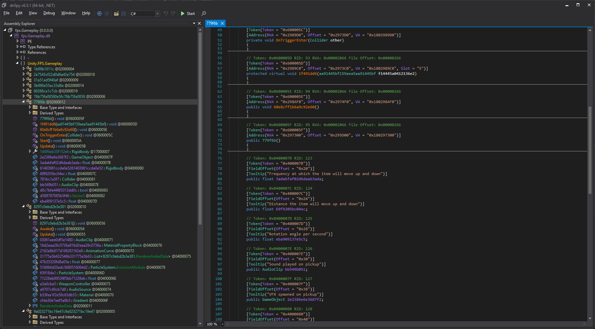

# Occulto
Occulto means "hide" or "conceal" in Latin. This project obfuscates names in Unity IL2CPP projects post-build. For more details, check out the associated blog article:
- [Protecting Unity's IL2CPP Builds](https://tulach.cc/protecting-unity-s-il2cpp-builds/)

